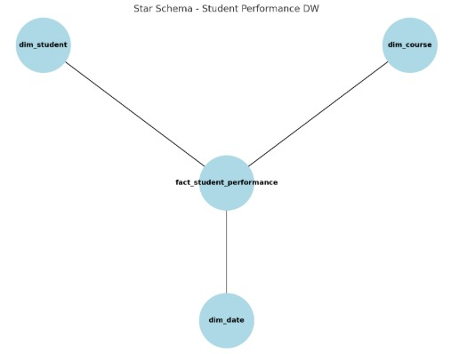

# Student Performance ETL Pipeline  

## 📌 Overview  
This project implements an **ETL (Extract, Transform, Load) pipeline** in Python for building a **Student Performance Data Warehouse**.  
The pipeline integrates student, course, and grade data from multiple sources, transforms it into a clean star schema, and loads it into a **SQL Server database**.  

The goal is to support reporting and analytics on student grades, attendance, and course performance.  

---

## 🗂️ Star Schema Design  
The data warehouse follows a **star schema** design:  

- **Dimension Tables**  
  - `dim_student`: Stores student information (ID, name, gender, city).  
  - `dim_course`: Stores course details (ID, name, credits).  
  - `dim_date`: Stores calendar attributes (date key, year, month, day).  

- **Fact Table**  
  - `fact_student_performance`: Stores student grades and attendance linked to student, course, and date dimensions.  

📂 Schema script: [`create_tables.sql`](create_tables.sql)  

### ERD Diagram  
  

---

## 🔄 ETL Workflow  

### 1. Extract  
- **Students** → from a text file (`students.txt`) using `pandas.read_csv` with a `|` delimiter.  
- **Grades** → from a JSON API export (`api_grades.json`).  
- **Courses** → from a SQLite database (`courses.db`).  

### 2. Transform  
- Cleans and validates student, course, and grade records.  
- Joins students, courses, and grades to create the **fact table**.  
- Generates the **date dimension** from grade dates (`DateKey`, Year, Month, Day).  
- Ensures all records have valid foreign keys to dimensions.  

### 3. Load  
- Connects to SQL Server using **pyodbc**.  
- Loads dimension data into:  
  - `dim_student`  
  - `dim_course`  
  - `dim_date`  
- Inserts fact data into:  
  - `fact_student_performance`  

📓 Pipeline implementation: [`ETL.ipynb`](ETL.ipynb)  

---

## ⚙️ Setup Instructions  

### 1. Prerequisites  
- Python 3.8+  
- SQL Server (or compatible RDBMS)  
- Required Python libraries:  
  ```bash
  pip install pandas pyodbc sqlalchemy
  
### 2. Create Database & Tables
  Run the SQL script in SQL Server Management Studio (SSMS): 
   ```bash
  CREATE DATABASE StudentPerformanceDW;
  USE StudentPerformanceDW;

### 3. Run the ETL Pipeline
  Open and execute the Jupyter Notebook:
  ```bash
  jupyter notebook ETL.ipynb
---
## 📂 Project Structure  
├── data/
│ ├── students.txt # Student data (CSV format with "|" delimiter)
│ ├── api_grades.json # Grades data (JSON)
│ ├── courses.db # Courses database (SQLite)
├── ETL.ipynb # ETL pipeline (Python Jupyter Notebook)
├── create_tables.sql # SQL script for schema creation
├── erd.png # ERD diagram (star schema)
└── README.md # Project documentation

---

## 🚀 Future Improvements  
- Automate ETL execution with **Airflow** or **Prefect**.  
- Add **data validation and logging**.  
- Support for **incremental loads**.  
- Visualization dashboards (e.g., **Power BI / Tableau**).  

